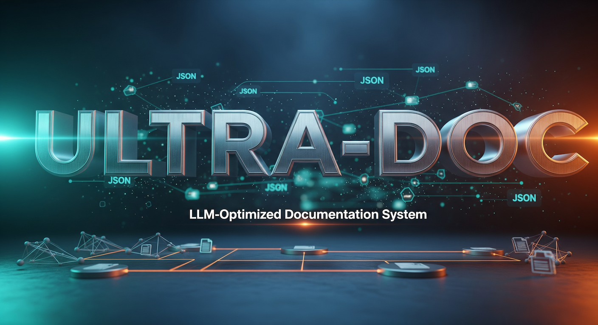
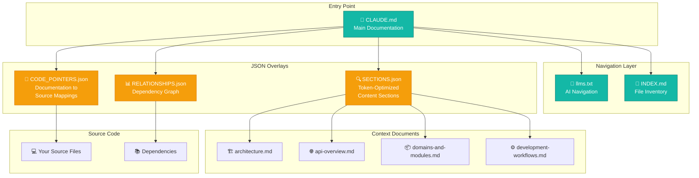
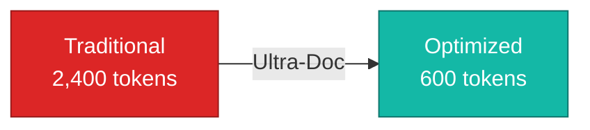
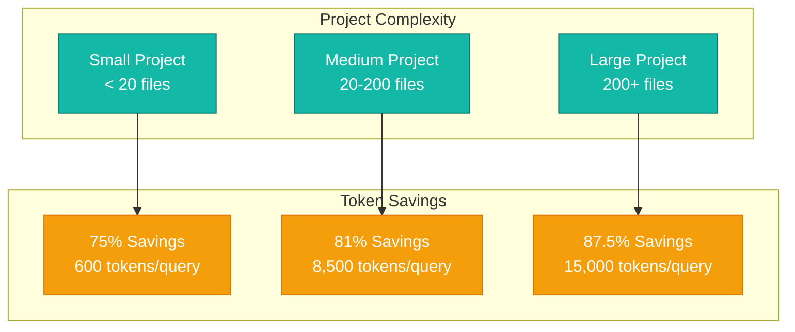
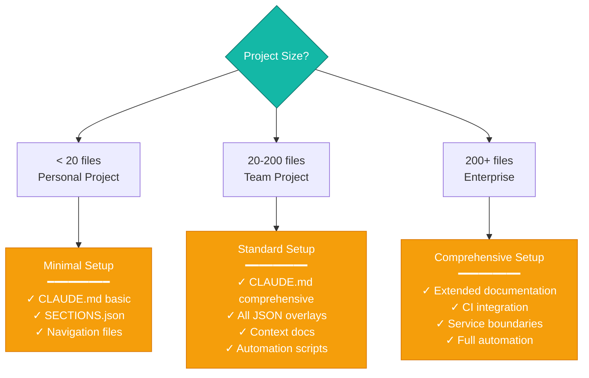
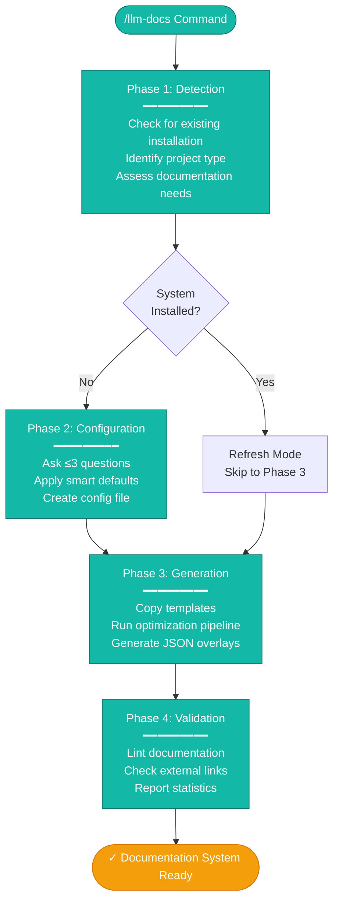
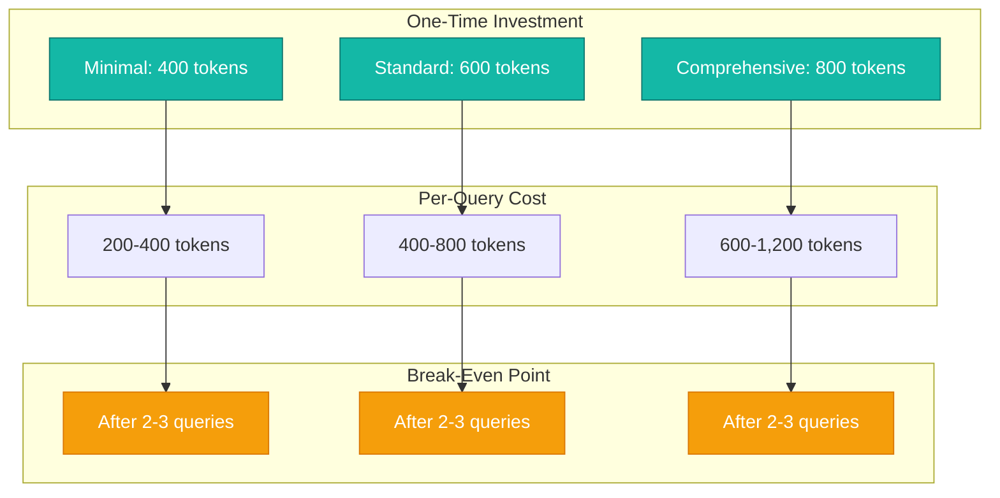
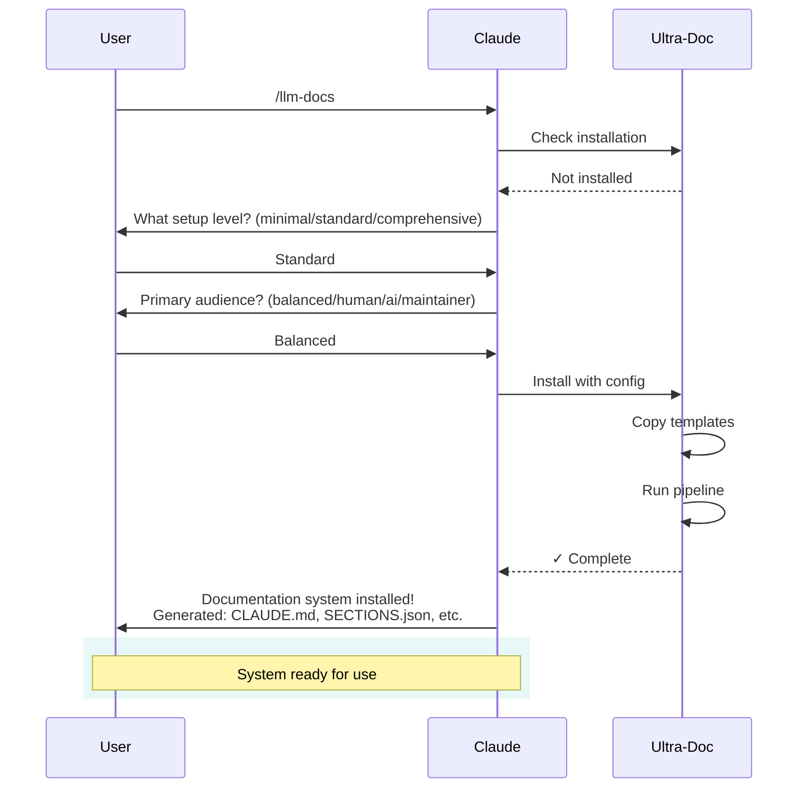

# Ultra-Doc: LLM-Optimized Documentation System for Claude Code

<div align="center">
  
</div>


**Generate token-efficient, AI-readable documentation with JSON overlays that reduce context usage by 60-90%**

<div align="center">
  
</div>

## What is Ultra-Doc?

Ultra-Doc is a Claude Code plugin that creates and maintains an LLM-optimized documentation system in any repository. Instead of AI assistants reading entire files (consuming thousands of tokens), Ultra-Doc generates JSON overlays that enable selective, token-efficient context retrieval.

The `/llm-docs` command transforms scattered documentation into a structured system with:
- Token-counted sections for efficient retrieval
- Code-to-documentation mappings
- Dependency graphs and relationships
- Progressive disclosure (overview → details → source)
- Tool-neutral design (works with any AI assistant)

> [!TIP]
> Run `/llm-docs` after major code changes to keep AI context fresh and accurate

<div align="center">
  
</div>

## Quick Start

### For Claude Code Users (Self-Install)

**Copy this entire prompt and paste it into Claude Code:**

```
Install the ultra-doc plugin from GitHub: /plugin install ultra-doc@github:justfinethanku/ultra-doc

This plugin creates LLM-optimized documentation systems with JSON overlays (SECTIONS.json, CODE_POINTERS.json, RELATIONSHIPS.json) that reduce AI context usage by 60-90%.

After you install it, tell me how it works and what the /llm-docs command does.
```

### Manual Installation

**Method 1: Install from GitHub (Recommended)**

```bash
/plugin install ultra-doc@github:justfinethanku/ultra-doc
```

**Method 2: Local Marketplace**

```bash
/plugin install ultra-doc@local-plugins
```

### Usage

**First run (installs documentation system):**

```bash
/llm-docs
```

**Subsequent runs (refreshes all artifacts):**

```bash
/llm-docs
```

<div align="center">
  
</div>

## Table of Contents

- [Quick Start](#quick-start)
- [What is Ultra-Doc?](#what-is-ultra-doc)
- [Visual Overview](#visual-overview)
- [Examples](#examples)
- [Comparison: With vs Without Ultra-Doc](#comparison-with-vs-without-ultra-doc)
- [How It Works](#how-it-works)
- [Why This Matters](#why-this-matters)
- [Token Economics](#token-economics)
- [Key Benefits](#key-benefits)
- [Plugin Structure](#plugin-structure)
- [Contributing](#contributing)
- [Security](#security)
- [Version](#version)
- [Support](#support)

<div align="center">
  
</div>

## Visual Overview

### Documentation Architecture



### Token Flow Comparison

<table>
<tr>
<td width="50%" valign="top">

**❌ Without Ultra-Doc**

```
Query 1: "Explain authentication"
├─ Read 15 files
└─ 8,000 tokens

Query 2: "Show API endpoints"
├─ Read 12 more files
└─ 6,000 tokens

Query 3: "Database connection?"
├─ Read 8 more files
└─ 4,000 tokens

Total: 18,000 tokens
```

**Problems:**
- Reads entire files each time
- No context reuse
- Context window filled quickly

</td>
<td width="50%" valign="top">

**✅ With Ultra-Doc**

```
Query 1: "Explain authentication"
├─ Query SECTIONS.json
└─ 2,400 tokens (targeted sections)

Query 2: "Show API endpoints"
├─ Query cached sections
└─ 800 tokens (reuse context)

Query 3: "Database connection?"
├─ Already in context
└─ 0 additional tokens

Total: 3,200 tokens
```

**Benefits:**
- Selective section retrieval
- Context reuse across queries
- **82% token reduction**

</td>
</tr>
</table>

<div align="center">
  
</div>

## Examples

### Example 1: Small Project (Minimal Setup)

**Task Input:**
```bash
/llm-docs
```

**Complexity:** Low (personal project, <20 files)
**Setup Time:** 2-3 minutes
**Questions Asked:** 1 (setup level only)

**Output Directory:**
```
your-project/
├── CLAUDE.md                       # 79-line overview
├── .llm-docs.config.json           # Configuration
└── context_for_llms/
    ├── llms.txt                    # Navigation guide
    ├── INDEX.md                    # File inventory
    └── SECTIONS.json               # Token-optimized sections
```

**Key Results:**
- Basic project documentation created
- AI can navigate project with llms.txt
- Sections queryable via SECTIONS.json
- No scripts or complex overlays

**Token Usage:**


**Savings: 75%** 🎉

<div align="center">
  
</div>

### Example 2: Production App (Standard Setup)

**Task Input:**
```bash
/llm-docs
```

**Complexity:** Medium (team project, 100+ files, multiple modules)
**Setup Time:** 4-5 minutes
**Questions Asked:** 2 (setup level + audience)

**Output Directory:**
```
production-app/
├── CLAUDE.md                       # 234-line comprehensive guide
├── .llm-docs.config.json           # Configuration
├── context_for_llms/
│   ├── llms.txt                    # AI navigation
│   ├── INDEX.md                    # File inventory with stats
│   ├── SECTIONS.json               # 847 sections, ~12,000 tokens
│   ├── CODE_POINTERS.json          # Maps docs → 47 source files
│   ├── RELATIONSHIPS.json          # Dependency graph (23 packages)
│   ├── architecture.md             # System design
│   ├── api-overview.md             # Endpoint documentation
│   ├── domains-and-modules.md      # Module breakdown
│   └── development-workflows.md    # Team processes
└── scripts/llm-docs/               # 8 automation scripts
```

**Key Results:**
- Complete documentation system installed
- JSON overlays enable selective retrieval
- Code pointers map concepts to implementation
- Auto-refresh with pipeline scripts

**Execution Sequence:**


**Token Usage:**
- Without Ultra-Doc: ~45,000 tokens (reading all docs + source)
- With Ultra-Doc: ~8,500 tokens (targeted section retrieval)
- **Savings: 81%** 🚀

<div align="center">
  
</div>

### Example 3: Enterprise Monorepo (Comprehensive Setup)

**Task Input:**
```bash
/llm-docs
```

**Complexity:** High (500+ files, multiple services, complex architecture)
**Setup Time:** 6-7 minutes
**Questions Asked:** 3 (all questions)

**Output Directory:**
```
enterprise-monorepo/
├── CLAUDE.md                       # 350+ line detailed documentation
├── .llm-docs.config.json           # Full configuration
├── context_for_llms/
│   ├── llms.txt                    # Service-aware navigation
│   ├── INDEX.md                    # Comprehensive inventory
│   ├── SECTIONS.json               # 2,341 sections, ~78,000 tokens
│   ├── CODE_POINTERS.json          # Maps to 287 source files
│   ├── RELATIONSHIPS.json          # Complex dependency graph
│   ├── architecture.md             # Detailed system design
│   ├── api-overview.md             # Full API documentation
│   ├── domains-and-modules.md      # Service boundaries
│   └── development-workflows.md    # CI/CD integration
├── scripts/llm-docs/               # All 8 scripts + CI hooks
└── .github/workflows/docs.yml      # CI validation
```

**Key Results:**
- Industrial-strength documentation system
- Service boundaries clearly defined
- CI integration validates docs on commit
- Token counting prevents context overflow

**Complexity vs Token Savings:**



**Token Usage:**
- Without Ultra-Doc: ~120,000 tokens (impossible in single context)
- With Ultra-Doc: ~15,000 tokens (intelligent section selection)
- **Savings: 87.5%** 💎

> [!IMPORTANT]
> Ultra-Doc makes enterprise-scale projects manageable within Claude's context window

<div align="center">
  
</div>

## Comparison: With vs Without Ultra-Doc

### Without Ultra-Doc (Traditional Approach):

**Iteration 1:**
```
User: "Explain the authentication system"
Claude: "Let me read through your files to understand it..."
[Reads 15 files, 8,000 tokens]
```

**Iteration 2:**
```
User: "Now show me the API endpoints"
Claude: "I'll search for API definitions..."
[Reads 12 more files, 6,000 tokens]
```

**Iteration 3:**
```
User: "How do these connect to the database?"
Claude: "Let me find the database layer..."
[Reads 8 more files, 4,000 tokens]
```

**Result:** 3 iterations, ~18,000 tokens, incomplete understanding

<div align="center">
  
</div>

### With Ultra-Doc:

**Interaction 1:**
```
User: "Explain the authentication system"
Claude: [Reads SECTIONS.json, fetches auth sections only]
"Based on architecture.md sections 3-5 and CODE_POINTERS.json..."
[Uses 2,400 tokens for targeted retrieval]
```

**Interaction 2:**
```
User: "Now show me the API endpoints"
Claude: [Already has context map, fetches API sections]
[Uses 800 tokens for specific sections]
```

**Result:** 2 interactions, ~3,200 tokens, complete understanding with navigation

**Savings:** 82% fewer tokens, instant navigation, persistent context

<div align="center">
  
</div>

## How It Works

### Setup Level Decision Tree



### Four-Phase Protocol



### Pipeline Execution Flow


<details>
<summary><strong>📋 Complete Script Reference</strong></summary>

| Script | Purpose | Output | Token Impact |
|--------|---------|--------|--------------|
| `optimize-for-llms.sh` | Pipeline orchestrator | Runs all scripts in sequence | N/A |
| `update-timestamps.mjs` | Timestamp maintenance | Updates "Last Updated" fields | Reduces stale context |
| `generate-section-index.mjs` | Section extraction | SECTIONS.json with token counts | 60-70% reduction |
| `add-code-pointers.mjs` | Code mapping | CODE_POINTERS.json | Direct navigation to source |
| `render-relationships.mjs` | Dependency analysis | RELATIONSHIPS.json | Context awareness |
| `generate-llm-index.mjs` | Navigation creation | llms.txt, INDEX.md | Fast orientation |
| `lint-documentation.mjs` | Quality validation | Error report | Prevents confusion |
| `check-external-links.mjs` | Link validation | Broken link report | Trust in references |

</details>

<div align="center">
  
</div>

## Why This Matters

### Before Ultra-Doc:
```
"What's the architecture?"
  → Claude reads 50 files
  → 20,000 tokens
  → Vague answer
  → Context window exhausted
```

**Problems:**
- Context window fills with file content, not actual work
- No efficient navigation system
- Documentation gets stale quickly
- Every session starts from scratch

<div align="center">
  
</div>

### With Ultra-Doc:
```
"What's the architecture?"
  → Claude reads SECTIONS.json
  → Fetches 3 relevant sections
  → 1,200 tokens
  → Precise, sourced answer
  → Context preserved for implementation
```

**Benefits:**
- Context preserved for actual development work
- Navigate efficiently via llms.txt
- Auto-refresh keeps documentation current
- Persistent context across sessions

> [!NOTE]
> The average developer session with Ultra-Doc saves **15,000-40,000 tokens** compared to traditional file reading

<div align="center">
  
</div>

## Token Economics

### Investment vs Returns



### Detailed Breakdown

| Setup Level | Installation Cost | Per Query Cost | Total After 5 Queries | Traditional Cost | Savings |
|------------|-------------------|----------------|----------------------|------------------|---------|
| **Minimal** | 400 tokens | 200-400 tokens | 1,400-2,400 tokens | 12,000 tokens | **60-70%** |
| **Standard** | 600 tokens | 400-800 tokens | 2,600-4,600 tokens | 45,000 tokens | **70-80%** |
| **Comprehensive** | 800 tokens | 600-1,200 tokens | 3,800-6,800 tokens | 120,000 tokens | **80-90%** |

> [!IMPORTANT]
> ROI is positive after just 2-3 queries and compounds with every subsequent use

### Token Savings Over Time


<div align="center">
  
</div>

## Key Benefits

✅ **Token Efficient** - JSON overlays reduce context usage by 60-90%
✅ **Progressive Disclosure** - Start with overview, dive deep when needed
✅ **Tool Neutral** - Works with any AI assistant, not just Claude
✅ **Auto-Maintained** - Scripts keep documentation fresh
✅ **Zero Code Generation** - All scripts pre-written and tested
✅ **Smart Defaults** - ≤3 questions with intelligent defaults
✅ **Persistent Context** - Survives session restarts
✅ **Scalable** - From personal projects to enterprise monorepos

<div align="center">
  
</div>

## What Happens on First Run



<div align="center">
  
</div>

## Plugin Structure

```
ultra-doc/
├── .claude-plugin/
│   └── plugin.json                 # Plugin metadata
├── commands/
│   └── llm-docs.md                 # Slash command definition
├── skills/
│   └── llm-docs-builder/
│       ├── SKILL.md                # Core implementation logic
│       ├── scripts/                # 8 automation scripts
│       │   ├── optimize-for-llms.sh
│       │   ├── generate-section-index.mjs
│       │   ├── add-code-pointers.mjs
│       │   ├── render-relationships.mjs
│       │   ├── generate-llm-index.mjs
│       │   ├── update-timestamps.mjs
│       │   ├── lint-documentation.mjs
│       │   └── check-external-links.mjs
│       └── templates/              # 7 documentation templates
│           ├── CLAUDE_minimal.md
│           ├── CLAUDE_standard.md
│           ├── CLAUDE_comprehensive.md
│           └── context-templates/
│               ├── architecture.md
│               ├── api-overview.md
│               ├── domains-and-modules.md
│               └── development-workflows.md
├── LICENSE                         # MIT License
├── README.md                       # This file
└── package.json                    # NPM metadata
```

<details>
<summary><strong>🔍 What Gets Generated in Your Repository</strong></summary>

When you run `/llm-docs`, Ultra-Doc creates this structure in **your** repository:

```
your-project/
├── CLAUDE.md                       # Main AI documentation
├── .llm-docs.config.json           # Configuration
├── context_for_llms/               # Documentation directory
│   ├── llms.txt                    # AI navigation guide
│   ├── INDEX.md                    # File inventory
│   ├── SECTIONS.json               # Token-optimized sections
│   ├── CODE_POINTERS.json          # Doc→source mappings
│   ├── RELATIONSHIPS.json          # Dependency graph
│   ├── architecture.md             # (Standard/Comprehensive)
│   ├── api-overview.md             # (Standard/Comprehensive)
│   ├── domains-and-modules.md      # (Standard/Comprehensive)
│   └── development-workflows.md    # (Standard/Comprehensive)
└── scripts/llm-docs/               # Automation scripts
    └── [8 scripts copied from plugin]
```

</details>

<div align="center">
  
</div>

## Contributing

This plugin is designed to evolve through community feedback:

1. **Test on real projects** (not toy examples)
2. **Document what works and what breaks**
3. **Propose specific improvements as issues**
4. **Share your template modifications as PRs**

**Good contributions:**
- "SECTIONS.json generation fails for [language], here's the fix"
- "Added [project type] detection, improves accuracy for [use case]"
- "Token counting is off by X% for [file type], try this formula"

See [CONTRIBUTING.md](CONTRIBUTING.md) for detailed guidelines.

<div align="center">
  
</div>

## Security

This plugin is safe to use:

✅ **No credentials required** - Pure local operations
✅ **No API keys needed** - No external services
✅ **No network access** - Everything runs locally
✅ **No data collection** - Your code stays private
✅ **Pure documentation** - Generates markdown and JSON only
✅ **Read-only analysis** - Never modifies source code

**The plugin uses only safe, local tools:**
- File reading (your documentation)
- JSON generation (overlay files)
- Markdown creation (documentation)
- Directory traversal (structure analysis)

<div align="center">
  
</div>

## Version

**Current Version:** v1.0.0 - Initial Release

<details>
<summary><strong>📅 Changelog</strong></summary>

### v1.0.0 (2025-01-15)
- Initial release
- Three-tier setup system (minimal, standard, comprehensive)
- JSON overlay generation (SECTIONS, CODE_POINTERS, RELATIONSHIPS)
- 8 automation scripts for pipeline execution
- 7 documentation templates
- Token counting and optimization (60-90% reduction)
- Full Claude Code plugin compatibility
- Progressive disclosure architecture
- Tool-neutral design

</details>

See [CHANGELOG.md](CHANGELOG.md) for complete version history.

<div align="center">
  
</div>

## Origin & Community

Created by **Jonathan Edwards** as part of the Claude Code plugin ecosystem initiative.

This is v1.0.0 of what aims to become the standard documentation generator for AI-assisted development. Community contributions welcome to improve token efficiency and documentation quality.

<div align="center">
  
</div>

## Support

- **Issues:** [GitHub Issues](https://github.com/jonathanedwards/ultra-doc/issues)
- **Discussions:** [GitHub Discussions](https://github.com/jonathanedwards/ultra-doc/discussions)
- **Author:** [Jonathan Edwards](https://github.com/jonathanedwards)

<div align="center">
  
</div>

<div align="center">

**Made for the Claude Code community** 🤖

*Reduce your token usage by 60-90% with intelligent documentation structure*


</div>