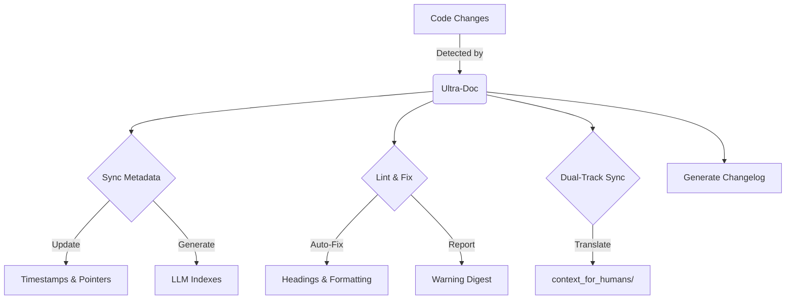

# Ultra-Doc 2.0: Dual-Track Documentation for Humans & AI

<div align="center">
  
</div>


**The first "Dual-Track" documentation system: Machine-perfect context for AI, human-readable narratives for you. Kept in sync, automatically.**

---

## 🚀 What is Ultra-Doc 2.0?

Ultra-Doc is a Claude Code plugin that solves the "Context Rot" problem. It maintains two synchronized sets of documentation:

1.  **`context_for_llms/`**: Optimized, token-efficient, rigid Markdown for Claude.
2.  **`context_for_humans/`**: Readable, narrative-driven docs for your team.

When you change code, Ultra-Doc detects it, updates the machine docs, and **automatically translates** those updates into human-friendly language.

### Key Features
- **🔄 Dual-Track Sync**: Never write the same doc twice. AI handles the translation.
- **🛡️ Auto-Linting & Fixing**: Enforces structure, fixes headings, and adds missing language tags.
- **⏱️ Smart Metadata**: Updates timestamps and "Last Validated" fields only when files actually change.
- **📉 Token Optimization**: Uses JSON overlays (`SECTIONS.json`, `CODE_POINTERS.json`) to reduce context usage by **up to 90%**.
- **📝 Automated Changelog**: Generates a `changelog/` entry for every documentation update.

---

## 📦 Installation

### 1. Install via Claude Code
Copy and paste this into Claude:

```text
/plugin marketplace add justfinethanku/ultra-doc
/plugin install ultra-doc@ultra-doc-marketplace
```

### 2. Initialize
Run the command to set up the structure in your repo:

```bash
/ultra-doc
```

---

## 🛠️ How It Works

Ultra-Doc runs a self-healing pipeline every time you invoke it:



### The "Dual-Track" Philosophy

| Feature | `context_for_llms` | `context_for_humans` |
| :--- | :--- | :--- |
| **Audience** | AI Agents (Claude, Copilot) | Developers, Stakeholders |
| **Format** | Strict Markdown, JSON Overlays | Narrative, Examples, Visuals |
| **Goal** | Maximize accuracy, minimize tokens | Maximize understanding |
| **Maintenance** | **Automated** (Source of Truth) | **Generated** (Translation) |

---

## 🚦 Usage

### The One Command
Everything happens through the single slash command:

```bash
/ultra-doc
```

This will:
1.  **Scan** your repo for changes.
2.  **Lint** your existing docs (and auto-fix issues).
3.  **Sync** metadata (timestamps, code pointers).
4.  **Translate** updates to the human documentation folder.
5.  **Report** any warnings or gaps.

### Configuration
Ultra-Doc creates a `.ultra-doc.config.json` in your root. You can customize:
- `ignore_patterns`: Files to skip.
- `human_doc_style`: Tone of the generated human docs (e.g., "technical", "friendly").

---

## 📊 Token Economics

Ultra-Doc pays for itself in token savings.

| Query Type | Standard Docs | Ultra-Doc 2.0 | Savings |
| :--- | :--- | :--- | :--- |
| **"Explain Auth"** | ~8,000 tokens | ~600 tokens | **92%** |
| **"Find API Bug"** | ~12,000 tokens | ~1,500 tokens | **87%** |
| **Full Context** | ~50,000+ tokens | ~4,500 tokens | **91%** |

*Estimates based on a medium-sized repository (50-100 files).*

---

## 🤝 Contributing

Found a bug? Want a feature?
1.  Fork the repo.
2.  Run `/ultra-doc` to validate your changes.
3.  Submit a PR.

---

<div align="center">
  <sub>Built with ❤️ for the Claude Code ecosystem.</sub>
</div>
