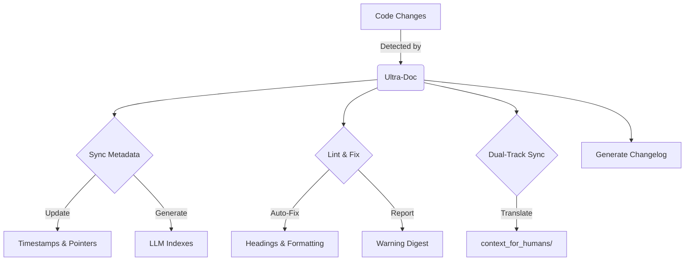

# Ultra-Doc 2.0: Dual-Track Documentation for Humans & AI

<div align="center">
  
</div>


**The first "Dual-Track" documentation system: Machine-perfect context for AI, human-readable narratives for you. Kept in sync, automatically.**

---

## 🚀 What is Ultra-Doc 2.0?

Ultra-Doc is a Claude Code plugin that solves the "Context Rot" problem. It maintains two synchronized sets of documentation:

1.  **`context_for_llms/`**: Optimized, token-efficient, rigid Markdown for Claude.
2.  **`context_for_humans/`**: Readable, narrative-driven docs for your team.

(Yes, we call them "Mike Dion" files. It's a thing. .md = Mike Dion. Get it? Moving on...)

When you change code, Ultra-Doc detects it, updates the machine docs, and **automatically translates** those updates into human-friendly language.

### Key Features
- **🔄 Dual-Track Sync**: Never write the same doc twice. AI handles the translation.
- **🛡️ Auto-Linting & Fixing**: Enforces structure, fixes headings, and adds missing language tags.
- **🕵️ File Reference Guard**: Inline references to `.mjs/.md/.json` files are linted so dead paths (like that fake `made-up/file.js`) never sneak into the docs.
- **⏱️ Smart Metadata**: Updates timestamps and "Last Validated" fields only when files actually change.
- **📉 Token Optimization**: Uses JSON overlays (`SECTIONS.json`, `CODE_POINTERS.json`) to reduce context usage by **up to 90%**.
- **📝 Automated Changelog**: Generates a `changelog/` entry for every documentation update.
- **📊 Health Snapshots**: Lint digests append validation + parity stats, and the summary report surfaces stale-doc counts, coverage, validation accuracy, and translation parity.

---

## 📦 Installation

### 1. Install via Claude Code (Fresh Install Prompt)
Open Claude Code, start a new chat with the repo, and paste the following message so Claude runs the marketplace commands for you:

```text
Hey Claude, please install Ultra-Doc 2.0 from the marketplace so this repo gets the dual-track automation.
/plugin marketplace add justfinethanku/ultra-doc
/plugin install ultra-doc@ultra-doc-marketplace
```

### 2. Upgrade from Ultra-Doc 1.x (Migration Prompt)
Already installed v1? Ask Claude to reinstall so the orchestrator, hooks, and scripts jump to 2.0 without hand-editing anything:

```text
Hey Claude, this repo still has Ultra-Doc 1.x. Please reinstall the latest Ultra-Doc 2.0 package and rerun its setup so the new orchestrator, hooks, and guardrails take effect.
/plugin marketplace add justfinethanku/ultra-doc
/plugin install ultra-doc@ultra-doc-marketplace
/ultra-doc install
```

### 3. Initialize
Run the command to set up the structure in your repo:

```bash
/ultra-doc
```

---

## 🛠️ How It Works

Ultra-Doc runs a self-healing pipeline every time you invoke it:



### The "Dual-Track" Philosophy

| Feature | `context_for_llms` | `context_for_humans` |
| :--- | :--- | :--- |
| **Audience** | AI Agents (Claude, Copilot) | Developers, Stakeholders |
| **Format** | Strict Markdown, JSON Overlays | Narrative, Examples, Visuals |
| **Goal** | Maximize accuracy, minimize tokens | Maximize understanding |
| **Maintenance** | **Automated** (Source of Truth) | **Generated** (Translation) |

---

## 🚦 Usage

### The One Command
Everything happens through the single slash command:

```bash
/ultra-doc
```

When invoked, Ultra-Doc:
1.  **Scans** the repo to understand doc health (refreshing `DOC_STATE.json` and priorities).
2.  **Chooses** the best workflow (full sync, quick lint, validation-only, or reporting) and either auto-runs it (if stale docs are found) or presents an interactive menu.
3.  **Executes** the selected action end-to-end (full sync now chains `track-code-changes.mjs` → `sync-doc-metadata.mjs` → `validate-accuracy.mjs` so self-healing happens automatically).
4.  **Reports** progress plus any warnings in plain language.

#### Decision-Tree Options

| Option | What Happens | Auto-run Trigger |
| :--- | :--- | :--- |
| **Full Sync** | track code changes → metadata refresh → translation → parity check → lint → accuracy validation → changelog/report | Detected stale docs or `ULTRA_DOC_AUTO_ACTION=sync` |
| **Quick Lint** | timestamps → autofix → lint digest | `ULTRA_DOC_AUTO_ACTION=quick` |
| **Validation Only** | `track-code-changes.mjs` + `validate-accuracy.mjs` | `ULTRA_DOC_AUTO_ACTION=validate` |
| **Summary** | Generates/prints `reports/ultra-doc-summary.md` (with doc health, validation, and parity status) | `ULTRA_DOC_AUTO_ACTION=summary` |

Set the `ULTRA_DOC_AUTO_ACTION` environment variable (as shown in `hooks.json`) when you need a non-interactive run; otherwise Ultra-Doc will prompt for a choice. Every run refreshes `SECTIONS.json`, `CODE_POINTERS.json`, `RELATIONSHIPS.json`, and `DOC_STATE.json` so Claude always sees the latest context, and the summary report surfaces stale-doc counts, lint numbers, validation accuracy, and translation parity to keep stakeholders aligned.

## 🧪 Quality Guardrails

### File Reference Enforcement
`skills/ultra-doc/scripts/lint-documentation.mjs` scans every inline code span that looks like a file path (`` `skills/ultra-doc/scripts/generate-report.mjs` ``, etc.) and verifies the file actually exists. Missing files are flagged in the CLI output **and** in `context_for_llms/LINT_WARNINGS.md`, so broken references get caught before they hit the repo.

### Validation + Parity Snapshots
Each lint run appends a "Validation Snapshot" (mirroring `context_for_llms/VALIDATION.json`) and a "Parity Snapshot" that lists any human docs lagging their machine twins. When you run the lightweight quick lint, Ultra-Doc sets `ULTRA_DOC_SKIP_PARITY=1`, logs that the parity check was skipped, and keeps the summary honest.

### Reporting at a Glance
`/ultra-doc` now regenerates `reports/ultra-doc-summary.md` on every run. The metrics table highlights stale-doc counts, overall coverage, validation accuracy, and whether the dual-track translations are still in parity, so non-technical teammates can skim one file instead of spelunking through JSON blobs.

### Configuration
Ultra-Doc creates a `.ultra-doc.config.json` in your root. You can customize:
- `ignore_patterns`: Files to skip.
- `human_doc_style`: Tone of the generated human docs (e.g., "technical", "friendly").

---

## 🔁 Automated Hooks

Ultra-Doc wires itself into Claude Code via `hooks.json` so documentation stays healthy even when humans forget to run `/ultra-doc`.

| Hook | Trigger | Command |
| --- | --- | --- |
| PreCommit | Before Claude stages/commits files. | `ULTRA_DOC_AUTO_ACTION=quick /ultra-doc` |
| SessionStart | When the repo opens in Claude Code. | Print latest `changelog/docs-*.md` entry. |
| UserPromptSubmit (`deploy|ship|release`) | Risky user prompts. | `ULTRA_DOC_AUTO_ACTION=quick /ultra-doc` |
| PostToolUse (`write_to_file` touching `context_for_llms`) | Manual edits to machine docs. | `ULTRA_DOC_AUTO_ACTION=sync /ultra-doc` |
| Idle | User idle while docs have pending work. | `ULTRA_DOC_AUTO_ACTION=summary /ultra-doc` |

Update this table (and `hooks.json`) together whenever hook behavior changes.

---

## 📊 Token Economics

Ultra-Doc pays for itself in token savings.

| Query Type | Standard Docs | Ultra-Doc 2.0 | Savings |
| :--- | :--- | :--- | :--- |
| **"Explain Auth"** | ~8,000 tokens | ~600 tokens | **92%** |
| **"Find API Bug"** | ~12,000 tokens | ~1,500 tokens | **87%** |
| **Full Context** | ~50,000+ tokens | ~4,500 tokens | **91%** |

*Estimates based on a medium-sized repository (50-100 files).*

---

## 🤝 Contributing

Found a bug? Want a feature?
1.  Fork the repo.
2.  Run `/ultra-doc` to validate your changes.
3.  Submit a PR.

---

<div align="center">
  <sub>Built with ❤️ for the Claude Code ecosystem.</sub>
</div>
