# Ultra-Doc: AI-Driven Documentation Maintenance System for Claude Code

<div align="center">
  
</div>


**Self-healing documentation powered by AI: automatic validation, staleness detection, error fixing, and gap finding**
<div align="center">
  
</div>

## Table of Contents

- [What is Ultra-Doc?](#what-is-ultra-doc)
- [Quick Start](#quick-start)
- [Visual Overview](#visual-overview)
- [Automatic Documentation Maintenance](#automatic-documentation-maintenance)
- [AI-Driven Validation](#ai-driven-validation)
- [What Ultra-Doc Catches](#what-ultra-doc-catches)
- [Examples](#examples)
- [How It Works](#how-it-works)
- [Token Economics](#token-economics)
- [Key Benefits](#key-benefits)
- [Plugin Structure](#plugin-structure)
- [Support](#support)


<div align="center">
  
</div>

## What is Ultra-Doc?

Ultra-Doc is a Claude Code plugin that **actively maintains** your documentation. Unlike traditional doc generators that create static files, Ultra-Doc continuously monitors your codebase for changes, validates documentation accuracy against actual code, automatically fixes errors, and identifies undocumented code.

**This is a self-healing documentation system powered by AI.**

The `/ultra-doc` command transforms your repository into a living documentation system that:
- **Detects when docs become stale** after code changes
- **Validates accuracy** by reading actual source code and detecting contradictions
- **Auto-fixes errors** including formatting issues, broken links, and factual errors
- **Finds gaps** in documentation coverage and writes missing docs
- **Prevents hallucinations** by requiring AI to cite sources and validate claims
- **Optimizes for tokens** with JSON overlays that reduce AI context usage by 60-90%

> [!TIP]
> Run `/ultra-doc` after major code changes to detect staleness, validate accuracy, and auto-fix any issues

<div align="center">
  
</div>

## Quick Start

### Make Claude Code install Ultra-Doc


**Copy this entire prompt and paste it into Claude Code:**

```
Install the ultra-doc plugin from GitHub: /plugin install ultra-doc@github:justfinethanku/ultra-doc

This plugin creates a self-healing documentation system that automatically detects when docs
become stale, validates accuracy against actual code, fixes errors automatically, and finds
undocumented code. It also uses JSON overlays to reduce AI context usage by 60-90%.

After you install it, tell me how it works and what the /ultra-doc command does.
```

### Do it manually (if you hate yourself)

**Method 1: Install from GitHub (Recommended)**

```bash
/plugin install ultra-doc@github:justfinethanku/ultra-doc
```

**Method 2: Local Marketplace**

```bash
/plugin install ultra-doc@local-plugins
```

### Usage

**First run (installs documentation system):**

```bash
/ultra-doc
```

**Subsequent runs (analyzes and presents interactive menu):**

```bash
/ultra-doc
```

<div align="center">
  
</div>

## Visual Overview

### Documentation Architecture

```mermaid
graph TB
    subgraph "Entry Point"
    CLAUDE[📄 CLAUDE.md<br/>Main Documentation]
    end

    subgraph "Navigation Layer"
    llms[🧭 llms.txt<br/>AI Navigation]
    INDEX[📑 INDEX.md<br/>File Inventory]
    end

    subgraph "JSON Overlays"
    SECTIONS[🔍 SECTIONS.json<br/>Token-Optimized<br/>Content Sections]
    POINTERS[🔗 CODE_POINTERS.json<br/>Documentation to<br/>Source Mappings]
    RELATIONS[📊 RELATIONSHIPS.json<br/>Dependency Graph]
    end

    subgraph "Health Tracking"
    STATE[📋 DOC_STATE.json<br/>Health Metrics<br/>Staleness Detection]
    COVERAGE[📊 COVERAGE.json<br/>Code Coverage<br/>Gap Analysis]
    VALIDATION[✅ VALIDATION.json<br/>Accuracy Results<br/>Error Reports]
    end

    subgraph "Context Documents"
    arch[🏗️ architecture.md]
    api[🌐 api-overview.md]
    domains[📦 domains-and-modules.md]
    workflows[⚙️ development-workflows.md]
    end

    subgraph "Source Code"
    src[💻 Your Source Files]
    deps[📚 Dependencies]
    end

    CLAUDE --> llms
    CLAUDE --> INDEX
    CLAUDE --> SECTIONS
    CLAUDE --> POINTERS
    CLAUDE --> RELATIONS

    SECTIONS --> arch
    SECTIONS --> api
    SECTIONS --> domains
    SECTIONS --> workflows

    POINTERS --> src
    POINTERS --> STATE
    POINTERS --> COVERAGE
    POINTERS --> VALIDATION
    RELATIONS --> deps

    style CLAUDE fill:#14b8a6,stroke:#0f766e,color:#fff
    style SECTIONS fill:#f59e0b,stroke:#d97706,color:#fff
    style POINTERS fill:#f59e0b,stroke:#d97706,color:#fff
    style RELATIONS fill:#f59e0b,stroke:#d97706,color:#fff
    style STATE fill:#14b8a6,stroke:#0f766e,color:#fff
    style COVERAGE fill:#14b8a6,stroke:#0f766e,color:#fff
    style VALIDATION fill:#14b8a6,stroke:#0f766e,color:#fff
    style llms fill:#14b8a6,stroke:#0f766e,color:#fff
    style INDEX fill:#14b8a6,stroke:#0f766e,color:#fff
```



### Token Flow Comparison

<table>
<tr>
<td width="50%" valign="top">

**❌ Without Ultra-Doc**

```
Query 1: "Explain authentication"
├─ Read 15 files
└─ 8,000 tokens

Query 2: "Show API endpoints"
├─ Read 12 more files
└─ 6,000 tokens

Query 3: "Database connection?"
├─ Read 8 more files
└─ 4,000 tokens

Total: 18,000 tokens
```

**Problems:**
- Reads entire files each time
- No context reuse
- Context window filled quickly
- No staleness detection
- No accuracy validation

</td>
<td width="50%" valign="top">

**✅ With Ultra-Doc**

```
Query 1: "Explain authentication"
├─ Query SECTIONS.json
└─ 2,400 tokens (targeted sections)

Query 2: "Show API endpoints"
├─ Query cached sections
└─ 800 tokens (reuse context)

Query 3: "Database connection?"
├─ Already in context
└─ 0 additional tokens

Total: 3,200 tokens
```

**Benefits:**
- Selective section retrieval
- Context reuse across queries
- **82% token reduction**
- Auto-detects stale docs
- Validates accuracy

</td>
</tr>
</table>

<div align="center">
  
</div>

## Automatic Documentation Maintenance

### The 5-Script Pipeline

Ultra-Doc uses a sophisticated pipeline of AI and deterministic scripts to maintain documentation health:

```mermaid
graph LR
    Start([Code Change]) --> Track[Track Changes<br/>━━━━━━━━━<br/>Monitors git history<br/>Maps to affected docs]
    Track --> Analyze[Analyze State<br/>━━━━━━━━━<br/>Health metrics<br/>Staleness risk]
    Analyze --> Coverage[Analyze Coverage<br/>━━━━━━━━━<br/>Find undocumented<br/>code]
    Coverage --> Validate[Validate Accuracy<br/>━━━━━━━━━<br/>AI reads code<br/>Detects errors]
    Validate --> Fix[Auto-Fix<br/>━━━━━━━━━<br/>Repairs errors<br/>Updates docs]
    Fix --> Done([✓ Healthy Docs])

    style Start fill:#14b8a6,stroke:#0f766e,color:#fff
    style Done fill:#f59e0b,stroke:#d97706,color:#fff
```



**1. Code Change Tracking**
- Monitors git history for file modifications
- Maps changed files to documentation via CODE_POINTERS.json
- Marks affected docs as "needs validation"
- Estimates impact (low/medium/high)

**2. Documentation State Analysis**
- Generates health metrics and completeness scores
- Assesses staleness risk based on code changes
- Creates priority list of what needs attention
- Outputs DOC_STATE.json

**3. Coverage Analysis**
- Identifies undocumented functions, classes, and modules
- Analyzes export patterns and usage counts
- Prioritizes what should be documented first
- Outputs COVERAGE.json

**4. Accuracy Validation**
- AI reads actual source code
- Compares code behavior to documentation claims
- Validates file paths, examples, and behavioral descriptions
- Detects contradictions and outdated information
- Outputs VALIDATION.json

**5. Automatic Fixing**
- Deterministically fixes linting issues (structure, formatting, links)
- AI fixes factual errors by reading code and updating docs
- AI updates documentation to reflect code changes
- AI writes missing documentation for gaps
- All changes validated before committing

<div align="center">
  
</div>

## AI-Driven Validation

### Narrow Path Validation Strategy

Ultra-Doc uses an innovative **narrow path validation** approach that makes accuracy checking "pretty easy":

```mermaid
graph TD
    Start[CODE_POINTERS.json<br/>Explicit doc → code links] --> Check{File changed<br/>since last<br/>validation?}
    Check -->|No| Skip[Skip - Still Valid]
    Check -->|Yes| Read[AI reads both:<br/>• Doc section<br/>• Source code]
    Read --> Compare[AI compares:<br/>Does doc match code?]
    Compare -->|Match| Update[Update lastValidated<br/>timestamp]
    Compare -->|Mismatch| Error[Add to VALIDATION.json<br/>with fix details]

    style Start fill:#14b8a6,stroke:#0f766e,color:#fff
    style Error fill:#dc2626,stroke:#991b1b,color:#fff
    style Update fill:#f59e0b,stroke:#d97706,color:#fff
```



**Why This Works:**
- No blind searching - follows explicit links
- No guessing - CODE_POINTERS.json knows exactly what relates to what
- Narrow, specific paths to validate
- Makes contradiction detection deterministic

### Hallucination Prevention

**CRITICAL RULES:**
1. **Always read source code** before writing documentation
2. **Every claim must cite source** (file:line references required)
3. **Validate AI-written content** before committing
4. **Report confidence scores** for each section
5. **Flag for human review** if confidence < 95%

**Example Citation:**
```markdown
The `authenticate()` function returns a JWT token on success.
Source: src/auth/authenticator.js:45-52
```

<div align="center">
  
</div>

## What Ultra-Doc Catches

### Staleness Detection

<table>
<tr>
<td width="50%" valign="top">

**Before (Stale Documentation):**

```markdown
# Authentication

The system uses session cookies
for authentication.

Sessions expire after 1 hour.
```

**Code Changed:**
```javascript
// auth.js
- sessionTimeout: 3600  // 1 hour
+ tokenExpiry: 86400    // 24 hours
+ useJWT: true
```

</td>
<td width="50%" valign="top">

**After (Auto-Updated):**

```markdown
# Authentication

The system uses JWT tokens
for authentication.

Tokens expire after 24 hours.

Source: src/auth/config.js:12-14
Last Validated: 2025-11-15
```

**Changes Detected:**
- Session → JWT switch detected
- Timeout value corrected
- Source citation added

</td>
</tr>
</table>

### Coverage Gap Detection

<table>
<tr>
<td width="50%" valign="top">

**COVERAGE.json Output:**

```json
{
  "undocumented": [
    {
      "file": "src/utils/validator.js",
      "exports": ["validateEmail", "sanitize"],
      "usage_count": 47,
      "priority": "high"
    }
  ],
  "stats": {
    "total_files": 120,
    "documented": 95,
    "coverage_percent": 79.2
  }
}
```

</td>
<td width="50%" valign="top">

**AI Action:**

```markdown
# Utility Functions

## Email Validation

`validateEmail(email: string): boolean`

Validates email addresses using RFC 5322
standard. Returns true if valid.

**Example:**
```js
validateEmail('user@example.com') // true
validateEmail('invalid') // false
```

Source: src/utils/validator.js:12-28
```

**Result:** Coverage → 80.8%

</td>
</tr>
</table>

### Accuracy Validation

<table>
<tr>
<td width="50%" valign="top">

**Documentation Claim:**

```markdown
The API supports pagination with
`limit` and `offset` parameters.

Maximum limit is 50 items.
```

**Actual Code:**

```javascript
const MAX_LIMIT = 100;

function paginate(limit, offset) {
  if (limit > MAX_LIMIT) {
    limit = MAX_LIMIT;
  }
  // ...
}
```

</td>
<td width="50%" valign="top">

**VALIDATION.json:**

```json
{
  "errors": [{
    "file": "docs/api-overview.md",
    "line": 45,
    "type": "factual_error",
    "claim": "Maximum limit is 50 items",
    "actual": "Maximum limit is 100 items",
    "source": "src/api/paginate.js:3",
    "auto_fixable": true,
    "confidence": 100
  }]
}
```

**Auto-Fixed:** ✅
Maximum limit is ~~50~~ **100** items.

</td>
</tr>
</table>

### Auto-Fix Capabilities

<table>
<tr>
<td width="50%" valign="top">

**Linting Errors Detected:**

```markdown
# Broken Structure

### Wrong heading level (should be ##)

```javascript  ← missing language tag
code here
```  ← extra spaces

-  Mixed list markers
*  In same list
```

</td>
<td width="50%" valign="top">

**Auto-Fixed:**

```markdown
# Fixed Structure

## Correct heading level

```javascript
code here
```

- Consistent list markers
- In same list
```

**Fixes Applied:**
- Heading hierarchy corrected
- Language tag added
- Trailing whitespace removed
- List markers standardized

</td>
</tr>
</table>

<div align="center">
  
</div>

## Examples

### Example 1: Small Project (Minimal Setup)

**Task Input:**
```bash
/ultra-doc
```

**Complexity:** Low (personal project, <20 files)
**Setup Time:** 2-3 minutes
**Questions Asked:** 1 (setup level only)

**Output Directory:**
```
your-project/
├── CLAUDE.md                       # 79-line overview
├── .ultra-doc.config.json           # Configuration
└── context_for_llms/
    ├── llms.txt                    # Navigation guide
    ├── INDEX.md                    # File inventory
    ├── SECTIONS.json               # Token-optimized sections
    ├── DOC_STATE.json              # Health tracking
    ├── COVERAGE.json               # Gap analysis
    └── VALIDATION.json             # Accuracy results
```

**Key Results:**
- Basic project documentation created
- AI can navigate project with llms.txt
- Sections queryable via SECTIONS.json
- Automatic staleness detection active
- Validation runs on demand

**Token Usage:**


**Savings: 75%** 🎉

<div align="center">
  
</div>

### Example 2: Production App (Standard Setup)

**Task Input:**
```bash
/ultra-doc
```

**Complexity:** Medium (team project, 100+ files, multiple modules)
**Setup Time:** 4-5 minutes
**Questions Asked:** 2 (setup level + audience)

**Output Directory:**
```
production-app/
├── CLAUDE.md                       # 234-line comprehensive guide
├── .ultra-doc.config.json           # Configuration
├── context_for_llms/
│   ├── llms.txt                    # AI navigation
│   ├── INDEX.md                    # File inventory with stats
│   ├── SECTIONS.json               # 847 sections, ~12,000 tokens
│   ├── CODE_POINTERS.json          # Maps docs → 47 source files
│   ├── RELATIONSHIPS.json          # Dependency graph (23 packages)
│   ├── DOC_STATE.json              # Comprehensive health metrics
│   ├── COVERAGE.json               # Detailed gap analysis
│   ├── VALIDATION.json             # Full accuracy tracking
│   ├── architecture.md             # System design
│   ├── api-overview.md             # Endpoint documentation
│   ├── domains-and-modules.md      # Module breakdown
│   └── development-workflows.md    # Team processes
└── scripts/ultra-doc/               # 13 automation scripts
```

**Key Results:**
- Complete documentation system installed
- JSON overlays enable selective retrieval
- Code pointers enable narrow path validation
- Auto-refresh pipeline keeps docs current
- Staleness detection active
- Coverage analysis identifies gaps
- Accuracy validation catches errors

**Execution Sequence:**


**Token Usage:**
- Without Ultra-Doc: ~45,000 tokens (reading all docs + source)
- With Ultra-Doc: ~8,500 tokens (targeted section retrieval)
- **Savings: 81%** 🚀

<div align="center">
  
</div>

### Example 3: Enterprise Monorepo (Comprehensive Setup)

**Task Input:**
```bash
/ultra-doc
```

**Complexity:** High (500+ files, multiple services, complex architecture)
**Setup Time:** 6-7 minutes
**Questions Asked:** 3 (all questions)

**Output Directory:**
```
enterprise-monorepo/
├── CLAUDE.md                       # 350+ line detailed documentation
├── .ultra-doc.config.json           # Full configuration
├── context_for_llms/
│   ├── llms.txt                    # Service-aware navigation
│   ├── INDEX.md                    # Comprehensive inventory
│   ├── SECTIONS.json               # 2,341 sections, ~78,000 tokens
│   ├── CODE_POINTERS.json          # Maps to 287 source files
│   ├── RELATIONSHIPS.json          # Complex dependency graph
│   ├── DOC_STATE.json              # Enterprise health tracking
│   ├── COVERAGE.json               # Cross-service gap analysis
│   ├── VALIDATION.json             # Multi-service validation
│   ├── architecture.md             # Detailed system design
│   ├── api-overview.md             # Full API documentation
│   ├── domains-and-modules.md      # Service boundaries
│   └── development-workflows.md    # CI/CD integration
├── scripts/ultra-doc/               # All 13 scripts + CI hooks
└── .github/workflows/docs.yml      # CI validation
```

**Key Results:**
- Industrial-strength documentation system
- Service boundaries clearly defined
- CI integration validates docs on commit
- Token counting prevents context overflow
- Automatic staleness detection across services
- Cross-service coverage analysis
- Comprehensive accuracy validation

**Complexity vs Token Savings:**


**Token Usage:**
- Without Ultra-Doc: ~120,000 tokens (impossible in single context)
- With Ultra-Doc: ~15,000 tokens (intelligent section selection)
- **Savings: 87.5%** 💎

> [!IMPORTANT]
> Ultra-Doc makes enterprise-scale projects manageable within Claude's context window while maintaining perfect accuracy

<div align="center">
  
</div>

## How It Works

### Interactive Decision Tree

```mermaid
graph TD
    Start([/ultra-doc]) --> Installed{System<br/>Installed?}

    Installed -->|No| Install[Install System<br/>━━━━━━━━━<br/>Ask 3 questions<br/>Create structure<br/>Run initial analysis]

    Installed -->|Yes| Analyze[Analyze Current State<br/>━━━━━━━━━<br/>Read health metrics<br/>Check for changes<br/>Detect gaps & errors]

    Install --> Analyze

    Analyze --> Present[Present Findings<br/>━━━━━━━━━<br/>Show health status<br/>List errors/gaps<br/>Display metrics]

    Present --> Menu{What to do?}

    Menu -->|Fix Errors| Fix[Auto-Fix Errors<br/>━━━━━━━━━<br/>Lint + AI fixes<br/>Validate changes<br/>Commit updates]

    Menu -->|Update Stale| Update[Update Changed Docs<br/>━━━━━━━━━<br/>Track code changes<br/>AI updates docs<br/>Validate accuracy]

    Menu -->|Document Gaps| Document[Write Missing Docs<br/>━━━━━━━━━<br/>Analyze code<br/>AI writes docs<br/>Add CODE_POINTERS]

    Menu -->|Full Refresh| Refresh[Run Full Pipeline<br/>━━━━━━━━━<br/>Fix + Update + Document<br/>Complete validation<br/>Comprehensive report]

    Menu -->|Show Details| Details[Detailed Analysis<br/>━━━━━━━━━<br/>Full metrics<br/>All issues<br/>Recommendations]

    Fix --> Report[Report Results]
    Update --> Report
    Document --> Report
    Refresh --> Report
    Details --> Report

    Report --> Done([✓ Complete])

    style Start fill:#14b8a6,stroke:#0f766e,color:#fff
    style Fix fill:#f59e0b,stroke:#d97706,color:#fff
    style Update fill:#f59e0b,stroke:#d97706,color:#fff
    style Document fill:#f59e0b,stroke:#d97706,color:#fff
    style Refresh fill:#f59e0b,stroke:#d97706,color:#fff
    style Done fill:#14b8a6,stroke:#0f766e,color:#fff
```



### Setup Level Decision Tree

```mermaid
graph TD
    Start{Project Size?} --> Small[< 20 files<br/>Personal Project]
    Start --> Medium[20-200 files<br/>Team Project]
    Start --> Large[200+ files<br/>Enterprise]

    Small --> Minimal[Minimal Setup<br/>━━━━━━━━━<br/>✓ CLAUDE.md basic<br/>✓ SECTIONS.json<br/>✓ Navigation files<br/>✓ Health tracking]
    Medium --> Standard[Standard Setup<br/>━━━━━━━━━<br/>✓ CLAUDE.md comprehensive<br/>✓ All JSON overlays<br/>✓ Context docs<br/>✓ Automation scripts<br/>✓ Full validation]
    Large --> Comprehensive[Comprehensive Setup<br/>━━━━━━━━━<br/>✓ Extended documentation<br/>✓ CI integration<br/>✓ Service boundaries<br/>✓ Full automation<br/>✓ Enterprise validation]

    style Start fill:#14b8a6,stroke:#0f766e,color:#fff
    style Minimal fill:#f59e0b,stroke:#d97706,color:#fff
    style Standard fill:#f59e0b,stroke:#d97706,color:#fff
    style Comprehensive fill:#f59e0b,stroke:#d97706,color:#fff
```



### Pipeline Execution Flow


<details>
<summary><strong>📋 Complete Script Reference</strong></summary>

### Analysis Scripts

| Script | Purpose | Output | What It Does |
|--------|---------|--------|--------------|
| `analyze-doc-state.mjs` | Documentation health analysis | DOC_STATE.json | Generates health metrics, completeness scores, staleness risk assessment, and validation flags |
| `analyze-coverage.mjs` | Code coverage gap detection | COVERAGE.json | Identifies undocumented code, analyzes exports, tracks usage counts, prioritizes documentation needs |
| `validate-accuracy.mjs` | AI-driven accuracy validation | VALIDATION.json | Validates file paths, code examples, behavioral claims; detects contradictions and outdated info |
| `track-code-changes.mjs` | Code change monitoring | Updates DOC_STATE.json | Monitors git history, maps changes to docs via CODE_POINTERS, estimates impact, marks docs for validation |

### Auto-Fix Scripts

| Script | Purpose | Output | What It Does |
|--------|---------|--------|--------------|
| `autofix-linting.mjs` | Deterministic error fixing | Fixed markdown files | Fixes heading structure, code block tags, whitespace, list markers, broken links automatically |

### Enhancement Scripts

| Script | Purpose | Output | What It Does |
|--------|---------|--------|--------------|
| `update-timestamps.mjs` | Timestamp maintenance | Updated docs | Adds/updates "Last Updated" fields to keep freshness visible |
| `generate-section-index.mjs` | Token optimization | SECTIONS.json | Extracts sections with token counts for efficient retrieval (60-70% reduction) |
| `add-code-pointers.mjs` | Code mapping | CODE_POINTERS.json | Creates explicit doc → code links for narrow path validation |
| `render-relationships.mjs` | Dependency analysis | RELATIONSHIPS.json | Generates dependency graphs and relationship maps |
| `generate-llm-index.mjs` | Navigation creation | llms.txt, INDEX.md | Creates AI-readable navigation files for fast orientation |
| `lint-documentation.mjs` | Quality validation | Error reports | Checks structure, formatting, consistency without auto-fixing |
| `check-external-links.mjs` | Link validation | Broken link reports | Validates external URLs, prevents documentation with dead links |

### Orchestrator

| Script | Purpose | Output | What It Does |
|--------|---------|--------|--------------|
| `optimize-docs.sh` | Full pipeline orchestration | Runs all scripts | Executes complete analysis, validation, and optimization pipeline in proper sequence |

</details>

<div align="center">
  
</div>

## Token Economics

### Investment vs Returns

### Detailed Breakdown

| Setup Level | Installation Cost | Per Query Cost | Total After 5 Queries | Traditional Cost | Savings |
|------------|-------------------|----------------|----------------------|------------------|---------|
| **Minimal** | 400 tokens | 200-400 tokens | 1,400-2,400 tokens | 12,000 tokens | **60-70%** |
| **Standard** | 600 tokens | 400-800 tokens | 2,600-4,600 tokens | 45,000 tokens | **70-80%** |
| **Comprehensive** | 800 tokens | 600-1,200 tokens | 3,800-6,800 tokens | 120,000 tokens | **80-90%** |

> [!IMPORTANT]
> ROI is positive after just 2-3 queries and compounds with every subsequent use. Token optimization is a byproduct of the real value: always-accurate, self-healing documentation.

### Token Savings Over Time


<div align="center">
  
</div>

## Key Benefits

✅ **Self-Healing** - Automatically detects and fixes documentation errors

✅ **Staleness Detection** - Tracks code changes and marks affected docs for validation

✅ **Accuracy Validation** - AI reads actual code to verify documentation claims

✅ **Gap Finding** - Identifies undocumented code and generates missing docs

✅ **Auto-Fixing** - Repairs linting issues, factual errors, and broken links automatically

✅ **Token Efficient** - JSON overlays reduce context usage by 60-90%

✅ **Hallucination Prevention** - Requires AI to cite sources and validate all claims

✅ **Progressive Disclosure** - Start with overview, dive deep when needed

✅ **Tool Neutral** - Works with any AI assistant, not just Claude

✅ **Zero Code Generation** - All scripts pre-written and tested

✅ **Smart Defaults** - ≤3 questions with intelligent defaults

✅ **Persistent Context** - Survives session restarts

✅ **Scalable** - From personal projects to enterprise monorepos

<div align="center">
  
</div>


## Plugin Structure

```
ultra-doc/
├── .claude-plugin/
│   └── plugin.json                 # Plugin metadata
├── commands/
│   └── ultra-doc.md                 # Slash command definition
├── skills/
│   └── ultra-doc/
│       ├── SKILL.md                # Core implementation logic
│       ├── scripts/                # 13 automation scripts
│       │   # Analysis Scripts
│       │   ├── analyze-doc-state.mjs
│       │   ├── analyze-coverage.mjs
│       │   ├── validate-accuracy.mjs
│       │   ├── track-code-changes.mjs
│       │   # Auto-Fix Scripts
│       │   ├── autofix-linting.mjs
│       │   # Enhancement Scripts
│       │   ├── generate-section-index.mjs
│       │   ├── add-code-pointers.mjs
│       │   ├── render-relationships.mjs
│       │   ├── generate-llm-index.mjs
│       │   ├── update-timestamps.mjs
│       │   ├── lint-documentation.mjs
│       │   ├── check-external-links.mjs
│       │   # Orchestrator
│       │   └── optimize-docs.sh
│       └── templates/              # 7 documentation templates
│           ├── CLAUDE_minimal.md
│           ├── CLAUDE_standard.md
│           ├── CLAUDE_comprehensive.md
│           └── context-templates/
│               ├── architecture.md
│               ├── api-overview.md
│               ├── domains-and-modules.md
│               └── development-workflows.md
├── LICENSE                         # MIT License
├── README.md                       # This file
└── package.json                    # NPM metadata
```

<details>
<summary><strong>🔍 What Gets Generated in Your Repository</strong></summary>

When you run `/ultra-doc`, Ultra-Doc creates this structure in **your** repository:

```
your-project/
├── CLAUDE.md                       # Main AI documentation
├── .ultra-doc.config.json           # Configuration
├── context_for_llms/               # Documentation directory
│   ├── llms.txt                    # AI navigation guide
│   ├── INDEX.md                    # File inventory
│   # Token Optimization Layer
│   ├── SECTIONS.json               # Token-optimized sections
│   ├── CODE_POINTERS.json          # Doc→source mappings
│   ├── RELATIONSHIPS.json          # Dependency graph
│   # Health Tracking Layer
│   ├── DOC_STATE.json              # Health metrics & staleness
│   ├── COVERAGE.json               # Gap analysis
│   ├── VALIDATION.json             # Accuracy results
│   # Context Documents (Standard/Comprehensive)
│   ├── architecture.md
│   ├── api-overview.md
│   ├── domains-and-modules.md
│   └── development-workflows.md
└── scripts/ultra-doc/               # Automation scripts
    └── [13 scripts copied from plugin]
```

</details>


<div align="center">
  
</div>

## Origin & Community

Created by **Jonathan Edwards** as part of the Claude Code plugin ecosystem initiative.

This is v1.0.0 of what aims to become the standard AI-driven documentation maintenance system for development. Community contributions welcome to improve validation strategies, accuracy detection, and auto-fix capabilities.

<div align="center">
  
</div>

## Support

- **Author:** [Jonathan Edwards](https://limitededitionjonathan.substack.com/)

<div align="center">
  
</div>

<div align="center">

**Made for the Claude Code community**

*Self-healing documentation powered by AI: automatic validation, staleness detection, error fixing, and gap finding*


</div>
